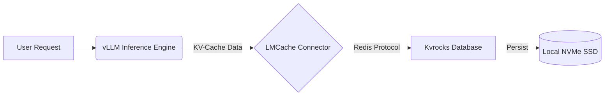
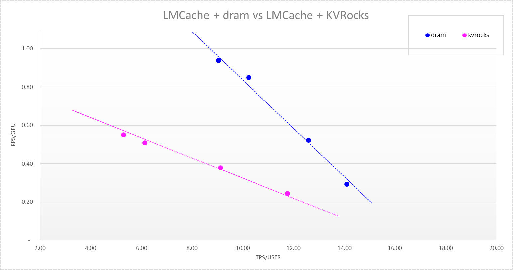

# 🚀 Hyper-Converged KV-Cache Offloading for Cost-Efficient LLM Inference

[](https://opensource.org/licenses/Apache-2.0)
[]()

## 📖 Overview

This project explores **System Architecture and Performance Engineering** for Large Language Model (LLM) inference, addressing the high cost and limited capacity of GPU High Bandwidth Memory (HBM). It delivers a **Hyper-Converged KV-Cache Offloading pipeline** leveraging **vLLM**, **LMCache**, and **Kvrocks** to redirect KV-cache data from GPU memory to high-throughput SSDs.

### 🎯 Project Goals
* **Design and implement** a robust PoC for LLM inference offloading.
* **Evaluate performance and cost-efficiency** of two architectures:
    * **Baseline:** DRAM-bound KV-Cache serving.
    * **Proposed:** SSD-based KV-Cache Offloading via Hyper-Converged Architecture.

---

## 🛠️ Technology Stack & Environment

| Component | Purpose | Details |
|-----------|---------|---------|
| **LLM Framework** | High-throughput inference | **vLLM** (Continuous Batching) |
| **Cache Offloading** | KV flow management | **LMCache** + **Kvrocks** |
| **Hardware** | Compute & Storage | NVIDIA GPUs, **Dual NVMe SSDs (RAID0)** |
| **Optimization** | Tuning | RocksDB compaction, vLLM flags |

---

## ⚡ Key Achievements

* **Infrastructure Foundation:** Provisioned a robust Hyper-Converged Kvrocks setup on a **RAID0 NVMe SSD array**, ensuring stability for high-throughput deployments.
* **System Optimization:** Tuned core RocksDB parameters and vLLM flags, resulting in a **1.5× improvement** in TPS/RPS (Transactions/Requests Per Second).
* **Performance Baseline:** Quantified DRAM caching as approx. **2.5× faster** than the SSD configuration, providing critical data for cost-performance trade-off decisions.
* **Architectural Insight:** Identified **network serialization** as the dominant bottleneck rather than disk I/O.

---

## 🏗️ Architecture & Installation

This section details the **Single-Node** architecture optimized for speed and simplicity.



### 1. Build and Run Kvrocks

Kvrocks is used as the storage engine. We build it from source to ensure optimal performance.

```bash
# Clone and Build
git clone [https://github.com/apache/kvrocks.git](https://github.com/apache/kvrocks.git)
cd kvrocks
./x.py build -DENABLE_LUA=ON

# Run Kvrocks
# Ensure your kvrocks.conf points 'dir' to your SSD mount point
./build/kvrocks -c config/kvrocks.conf

```

**Key Configuration (`config/kvrocks.conf`):**

```ini
bind 0.0.0.0
port 6666
dir /mnt/nvme_raid/kvrocks_data  # Pointing to fast storage
daemonize yes

```

### 2. Connect vLLM to Kvrocks

Configure vLLM to offload cache to the local Kvrocks instance using LMCache.

**Configuration (`config/lmcache_config.yaml`):**

```yaml
chunk_size: 1024
remote_url: "redis://127.0.0.1:6666"
kv_connector: "LMCacheConnectorV1"
kv_role: "kv_both"

```

---

## 📈 Performance Visualization

> **Note:** The graphs below illustrate the performance delta and optimization impact.

### Figure 1: DRAM vs Kvrocks Initial Benchmark

*Blue line: DRAM | Pink line: Kvrocks — Illustrates the 2.5× TPS difference.*

<br>

### Figure 2: Kvrocks Optimization (Before vs. After Tuning)

*Purple line: Baseline | Pink line: Tuned — Highlights the 1.5× improvement.*

---

## 📊 Performance Insights

1. **Latency & Bottlenecks:** Network serialization dominates over disk I/O.
2. **Chunk Size Trade-off:** Larger cache chunks reduce hit rate (77% → 69%), requiring careful balance.
3. **Baseline Comparison:** DRAM caching outperforms SSD offloading, guiding cost-performance trade-offs.

---

## 📝 Disclaimer

The benchmarking code, internal datasets, and specific proprietary performance metrics are **Intellectual Property (IP) of Pliops** and are not included in this repository. This repository serves as a reference implementation for the open-source infrastructure setup.

---

### 🙌 Acknowledgments

* **Pliops** for the mentorship and resources.
* **KamaTech** for the bootcamp platform.
